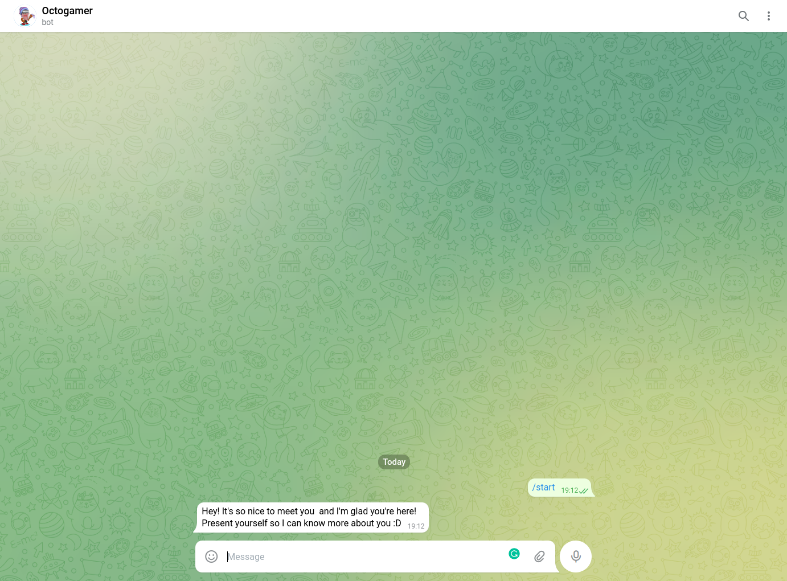

# Quick Start


Let's make a quick example of a Telegram bot using strabot. Let me present you our bot and friend called **Octogamer**: A specialist in games. You're gonna need to create a bot on Telegram, that is a pretty easy task using the @Botfather.

> If you don't know how to create, you can see the steps here: [Creating a new bot](https://core.telegram.org/bots#creating-a-new-bot)

Remember to get two important informations after create the bot:

* Token
* Username

We're gonna need these two soon.

## Setting up the Manager

Let's create our manager by using the following command:

```shell
npx @strabot/cli create manager --name octogamer-manager
```

When completed, you can open the manager running by default on `http://localhost:1337`.

1. Create the first user
2. Open the **Content Manager** in the left menu
3. Open the **Telegram config** in the content manager menu
4. Active the bot for telegram
5. Put the bot token in the **Token** field
6. Active private chats
7. Save the changes
8. Open the **Settings** in the left menu
9. Open the **API Tokens** in the settings menu
10. Create a *Full access* token and save it for later

## Setting up the Bot

Now, in another terminal, we can give life to our telegram bot with the next commands:

```shell
npx @strabot/cli create bot --platform telegram --name octogamer-telegram
cd octogamer-telegram
```

Put the API Token in the `STRABOT_MANAGER_TOEKN` key of the `.env` file. Something like:

```env
STRABOT_MANAGER_URL=http://localhost:1337/api
STRABOT_MANAGER_TOKEN=fa1fd94df734f0226b60f7d9d4313339c6c104df4a9b0fb3581b7c236db7a8e940b328dc434f478e2b8c8cc5217d1294191f353a745846873ec2755e62f4da36aa22446bf9aabf5c46521a0baef272151fb096d2c31e826e38f90fd0ee86494c4d6f4363fc921d36bd6d3357ff32c69af17ca4aa217a3efe66db80d6e919a88d
```

Then you can finally start your bot:

```
npm run develop
```

And talk to him:

<p align="center">
  
</p>
